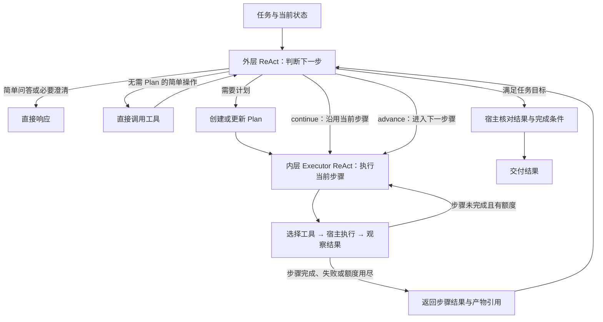

# Remotion Agent 重构 RFC

- 状态：Draft，已合入 2026-09-29 的工具分类和双层 ReAct 说明。
- 参考基线：首次调研的本地 main（`cc5d112`）及 [PR #74](https://github.com/HsiangNianian/IntelligentMixVideo/pull/74)（当时 head 为 `f4002db`）。接入时需重新核对实际合入版本。
- 范围：本次仅更新重构文档；以下工具名、数据结构和计数细则是设计提案，尚未实现。

## 1. 背景与重构范围

当前 [Harness](./harness.py) 由统一 Actor 理解请求、提交 TSX 并根据宿主诊断修复，
工具主要是 `read_current_template`、`submit_candidate`、`respond`。Runtime 管理任务、
历史、取消与成功版本；Renderer 和宿主负责隔离执行、检查与证据保存。

PR #74 提供 Sprite 创作、发布、绑定、预览和透明视频渲染能力。本次只重构 Agent 及其必要的兼容
适配，接入已有 Sprite 能力。PR 的其他功能、接口和存储行为维持原状；PR 尚未实现的合成总线接入等
功能不因此扩展。文档中的目标工具也不代表 PR 已经提供同名接口。

本次重构包括：

1. 外层任务 ReAct 判断是否需要 Plan，负责快速响应、制定计划及根据执行结果更新计划。
2. 内层 Executor ReAct 围绕当前步骤选择工具、执行、观察结果，达到工具额度后交回外层。
3. 工具按图片、Presets、validate、sprite、Tools 本身五类组织。
4. 通过结构化、可参数化的 Remotion Preset 复用资产，使用预设时 Agent 只填参数。
5. 对接 PR #74 的 Agent 输入输出和现有功能，保持公开聊天、参数修订、预览和成功版本兼容。

本期暂不设计截图抽帧校验、可执行的独立 JEV 模式、额外技能发现系统或多实例共享存储实现；JEV 只保留
一个不可执行的 TODO 工具占位。
Preset 搜索当前使用语义搜索，后续改为 JEV。超分模型和服务细节等待补充。
`tool2/tool3` 是会议笔记中的临时顺序，`reset` 不再作为独立工具分类。

## 2. Preset 定义与复用边界

**Preset 是原子化的 Remotion 代码资产：具有明确的结构化参数入口，填入符合契约的参数后，
即可形成可运行的 Remotion 实现。** 它保存代码、参数契约和可运行默认值，而不是仅保存一段 Prompt、
效果描述或一个已经渲染好的视频。

| 内容 | 用途 |
| --- | --- |
| `preset_id / revision / content_hash` | 唯一定位本次使用的代码与参数契约 |
| `type / name / description` | 资产分类、展示和语义搜索 |
| `tsx_code` | 可复用的 Remotion 实现 |
| `config_schema / default_props` | 参数类型、范围、默认值及其代码入口 |
| 参数与现有 spec 的绑定 | 沿用实际需要的宿主绑定，例如 `x-imv-target`，不额外引入一套重复映射 |
| 验证记录与运行时要求 | 记录代码测试结果以及支持的画布、依赖和素材能力 |

使用链路为：语义搜索 → 选择固定修订 → Agent 生成参数 → 宿主校验参数 → 实例化并创建 Sprite。
例如同一标题预设先填“今日灵感”与白色，再填“本周推荐”与黄色；代码和预设 hash 保持不变，
两份实例参数和产物各自保存。参数通过受管 props/config 注入，不做不受控的 TSX 字符串替换。

创建、修改预设也是 Agent 的工具能力。只有调用 `preset.create` 或 `preset.modify` 时才进入
代码创作；修改生成新修订，不能在普通填参路径中偷偷改变共享代码。没有合适预设时，外层可调整计划，
先创建或修改预设，再使用其参数契约生成资产。这些操作属于同一个 Agent，无须用户切换三个互斥模式。

“原子化”指预设的实现和参数职责清楚，不要求额外启动一个模型服务。Preset 不包含某次混剪的业务绝对
时间；创作使用的示例文字和示例时长可以作为默认参数，最终业务值仍由现有调用方提供。

## 3. 双层 ReAct

### 3.1 外层任务循环与内层执行循环

外层本身是 ReAct，不是只在任务开始调用一次的独立 Planner。它持续读取用户意图、当前 Plan、
步骤结果、资产引用和剩余额度，然后判断下一步动作。内层 Executor 是另一个 ReAct，只推进当前
逻辑步骤，不自行重写整个 Plan。

无需 Plan 时可以直接回答或执行简单工具操作，例如获取图片尺寸；不会先生成一个形式上的 Plan，
也不强制再调用 Executor 模型。操作仍由同一宿主工具调度器执行，遵守同样的计数、超时和取消规则。
发现任务变复杂时，外层转入计划路径。

有 Plan 时，每个步骤描述要达到的目标和完成条件，可以包含多次不同工具调用。例如“制作标题 Sprite”
可以依次搜索预设、填写参数、创建 Sprite 和校验视频；Plan 的 step 不是单个固定 tool call。

| 外层动作 | 含义 |
| --- | --- |
| `continue` | 当前逻辑步骤未完成，但方向仍有效；保留 Plan，继续该步骤 |
| `advance` | 当前步骤完成，进入 Plan 的下一待执行步骤 |
| `update_plan` | 当前方案需要调整；根据实际结果修订未完成步骤，再调度 Executor |
| `complete` | 任务目标和所需结果齐全，请宿主执行最终核对 |
| `needs_input / stop` | 缺少必需输入或已无法继续，返回明确状态 |
