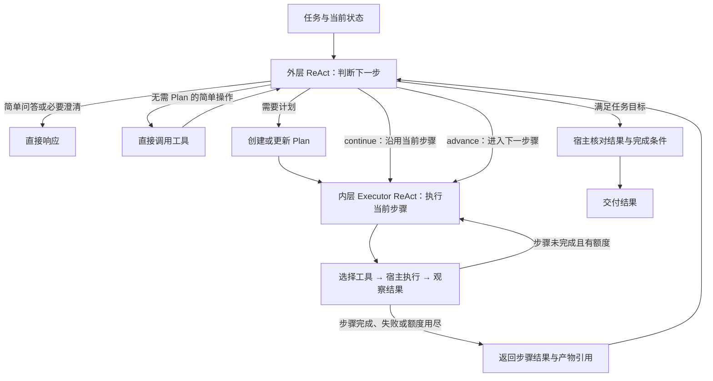

# Remotion Agent 重构 RFC

> 历史设计记录：双层循环与旧工具名称已由三层 ReAct 和 PR76 契约取代。当前实现及验证步骤以 [README](README.md) 与 [PR76 工具契约](../../../../docs/remotion-agent-tool-contracts.md) 为准。

- 状态：已开始落地；当前实现与验证方式见同目录 README，图片工具按本次要求由其他实现方接入。
- 参考基线：首次调研的本地 main（`cc5d112`）及 [PR #74](https://github.com/HsiangNianian/IntelligentMixVideo/pull/74)（当时 head 为 `f4002db`）。接入时需重新核对实际合入版本。
- 实现基线：PR #74 head `f4002db42efbfe7477020ded51e78f5fbafb74f0`；保持其发布/绑定/预览接口。下文保留设计依据，具体已实现契约以 README 和工具 Schema 为准。

## 1. 背景与重构范围

当前 [Harness](./harness.py) 由统一 Actor 理解请求、提交 TSX 并根据宿主诊断修复，
工具主要是 `read_current_template`、`submit_candidate`、`respond`。Runtime 管理任务、
历史、取消与成功版本；Renderer 和宿主负责隔离执行、检查与证据保存。

PR #74 提供 Sprite 创作、发布、绑定、预览和透明视频渲染能力。本次只重构 Agent 及其必要的兼容
适配，接入已有 Sprite 能力。PR 的其他功能、接口和存储行为维持原状；PR 尚未实现的合成总线接入等
功能不因此扩展。文档中的目标工具也不代表 PR 已经提供同名接口。

本次重构包括：

1. 外层任务 ReAct 判断是否需要 Plan，负责快速响应、制定计划及根据执行结果更新计划。
2. 内层 Executor ReAct 围绕当前步骤选择工具、执行、观察结果，达到工具额度后交回外层。
3. 工具按图片、Presets、validate、sprite、Tools 本身五类组织。
4. 通过结构化、可参数化的 Remotion Preset 复用资产，使用预设时 Agent 只填参数。
5. 对接 PR #74 的 Agent 输入输出和现有功能，保持公开聊天、参数修订、预览和成功版本兼容。

本期暂不设计截图抽帧校验、可执行的独立 JEV 模式、额外技能发现系统或多实例共享存储实现；JEV 只保留
一个不可执行的 TODO 工具占位。
Preset 搜索当前使用语义搜索，后续改为 JEV。超分模型和服务细节等待补充。
`tool2/tool3` 是会议笔记中的临时顺序，`reset` 不再作为独立工具分类。

## 2. Preset 定义与复用边界

**Preset 是原子化的 Remotion 代码资产：具有明确的结构化参数入口，填入符合契约的参数后，
即可形成可运行的 Remotion 实现。** 它保存代码、参数契约和可运行默认值，而不是仅保存一段 Prompt、
效果描述或一个已经渲染好的视频。

| 内容 | 用途 |
| --- | --- |
| `preset_id / revision / content_hash` | 唯一定位本次使用的代码与参数契约 |
| `type / name / description` | 资产分类、展示和语义搜索 |
| `tsx_code` | 可复用的 Remotion 实现 |
| `config_schema / default_props` | 参数类型、范围、默认值及其代码入口 |
| 参数与现有 spec 的绑定 | 沿用实际需要的宿主绑定，例如 `x-imv-target`，不额外引入一套重复映射 |
| 验证记录与运行时要求 | 记录代码测试结果以及支持的画布、依赖和素材能力 |

使用链路为：语义搜索 → 选择固定修订 → Agent 生成参数 → 宿主校验参数 → 实例化并创建 Sprite。
例如同一标题预设先填“今日灵感”与白色，再填“本周推荐”与黄色；代码和预设 hash 保持不变，
两份实例参数和产物各自保存。参数通过受管 props/config 注入，不做不受控的 TSX 字符串替换。

创建、修改预设也是 Agent 的工具能力。只有调用 `preset.create` 或 `preset.modify` 时才进入
代码创作；修改生成新修订，不能在普通填参路径中偷偷改变共享代码。没有合适预设时，外层可调整计划，
先创建或修改预设，再使用其参数契约生成资产。这些操作属于同一个 Agent，无须用户切换三个互斥模式。

“原子化”指预设的实现和参数职责清楚，不要求额外启动一个模型服务。Preset 不包含某次混剪的业务绝对
时间；创作使用的示例文字和示例时长可以作为默认参数，最终业务值仍由现有调用方提供。

## 3. 三层 ReAct

### 3.1 外层任务、Plan 与 Executor 循环

外层本身是 ReAct，不是只在任务开始调用一次的独立 Planner。它持续读取用户意图、当前 Plan、
步骤结果、资产引用和剩余额度，然后把需要编排的任务交给独立 Plan ReAct。Plan ReAct 维护顺序
步骤、保留已完成结果并唤醒 Executor ReAct；Executor 只推进当前逻辑步骤，不自行重写整个 Plan。



无需 Plan 时可以直接回答或执行简单工具操作，例如获取图片尺寸；不会先生成一个形式上的 Plan，
也不强制再调用 Executor 模型。操作仍由同一宿主工具调度器执行，遵守同样的计数、超时和取消规则。
发现任务变复杂时，外层转入计划路径。

有 Plan 时，每个步骤描述要达到的目标和完成条件，可以包含多次不同工具调用。例如“制作标题 Sprite”
可以依次搜索预设、填写参数、创建 Sprite 和校验视频；Plan 的 step 不是单个固定 tool call。

| 外层动作 | 含义 |
| --- | --- |
| `continue` | 当前逻辑步骤未完成，但方向仍有效；保留 Plan，继续该步骤 |
| `advance` | 当前步骤完成，进入 Plan 的下一待执行步骤 |
| `update_plan` | 当前方案需要调整；根据实际结果修订未完成步骤，再调度 Executor |
| `complete` | 任务目标和所需结果齐全，请宿主执行最终核对 |
| `needs_input / stop` | 缺少必需输入或已无法继续，返回明确状态 |

Executor 的结果至少包含 `plan_revision`、`step_id`、执行批次、状态、已完成内容、产物/诊断引用和
本批调用数。状态可为 `step_done`、`tool_limit_reached`、`blocked`、`needs_input`；
达到工具上限只是交还控制权，不能自动被解释为整个任务失败或步骤完成。

### 3.2 Plan 数据与更新

以下为顺序 Plan 的提议格式；本期不要求通用 DAG 调度或并发 Executor。

```json
{
  "plan_revision": 1,
  "goal": "制作标题 Sprite，并与已有装饰 Sprite 合成",
  "steps": [
    {
      "id": "title",
      "goal": "选择标题预设、填参并生成标题 Sprite",
      "input_refs": ["user_intent"],
      "tool_modules": ["tools", "preset", "validate", "sprite"],
      "done_when": "本步骤的标题 Sprite 已保存，所需代码和视频检查通过"
    },
    {
      "id": "combine",
      "goal": "把标题与已有装饰合成",
      "input_refs": ["steps.title.outputs.sprite", "inputs.decoration_sprite"],
      "tool_modules": ["tools", "validate", "sprite"],
      "done_when": "合成 Sprite 已保存，所需检查通过"
    }
  ],
  "limits": {"max_steps": 4, "max_tooluse": 10}
}
```

这是模型可见的宿主快照；`limits` 由宿主确定，模型不能改大。Plan 校验检查步骤引用、可用工具范围、
参数契约以及用户明确指定的类型和画布。模型估计和步骤完成描述不是新的用户要求，也不能自行降低
宿主验收条件。

`continue` 不改变 `plan_revision`，也不把未完成的 `step_id` 标成完成。
`update_plan` 递增修订号，保留已经完成的动作和产物引用，只调整确实需要变化的部分；已有工具回执
和预算记录不会被重写。输入、代码或参数改变时，旧验证结果只对原输入有效。
同一时刻只有一个 Executor 执行；外层收到本批结果后再决定下一批。

### 3.3 max_steps、max_tooluse 与 continue

要求保留：

```text
total_tooluse = max_steps * max_tooluse
actual_tooluse <= total_tooluse
```

为了同时支持“当前步骤执行到上限后继续”和这个总上限，本 RFC 建议区分**逻辑步骤**与**执行批次**：

| 名称 | 提议语义 |
| --- | --- |
| 逻辑步骤 `step_id` | Plan 中的一项工作，可跨多个执行批次完成 |
| `max_steps` | 单次任务最多允许启动的执行批次数；继续、改计划后执行及快速工具操作均消耗批次 |
| `max_tooluse` | 每个执行批次最多允许的工具调用数 |
| `total_tooluse` | 单次任务的工具调用硬上限，不是必须用满的次数 |

继续同一逻辑步骤时启动新批次，最多再得到 `max_tooluse` 次调用，并消耗一个剩余 `max_steps`
名额；Plan 本身不必修改。如果把 `max_steps` 仅理解为去重后的逻辑步骤数，则需要另加 continuation
上限，才能维持上述乘积；本提案采用执行批次计数，避免新增这个预算维度。

例如 `max_steps=4`、`max_tooluse=10`：

1. 批次 1 执行 step 1，调用 10 次后仍未完成，返回 `tool_limit_reached`。
2. 外层选择 `continue`；批次 2 继续原 step 1，调用 3 次后完成，Plan 未改变。
3. 外层进入 step 2；批次 3 调用 5 次后发现方案不适合，交回外层更新 Plan。
4. 外层派发批次 4，最多调用 10 次。此后不能继续派发；整个任务至多 40 次工具调用，本例至多 28 次。

未使用的批次额度不会让后续单批超过 10 次；达到 10 次时在第 11 次执行前交回外层。
已用满批次后，外层仍可依据现有结果完成或返回停止原因，但不能靠改 Plan 申请新额度。
普通问答不消耗工具批次；快速工具路径和外层的 `tools.find/inspect` 调用也计入工具账本。

预算由宿主统一记录，单次调用、失败调用及显式重试都计数；一条模型消息中的多个调用逐条计数。
模型只输出说明文字不算工具调用，但仍受模型请求超时、任务超时和无进展保护约束。
内部确定性的渲染/检查子程序记作工具的子操作，不递归启动隐藏 Agent；工具回执记录这些耗时和诊断。

外层、Plan 和 Executor 三层模型调用分别记账，同时复用当前任务的模型 token/调用预算策略。`max_steps/max_tooluse` 是本次
新循环的执行边界，提议始终生效，独立于当前 `IMV_ENFORCE_MODEL_BUDGET` 开关；修改该开关不应使
continue 无限执行。执行批次、实际工具调用和逻辑步骤分别统计，公开阶段不把三者混为一谈。

## 4. 工具按功能模块分类

工具只分五类。表中的 `module.operation` 是逻辑命名；Provider 若要求扁平 function name，可用
`module_operation` 映射，不能把供应商命名限制变成新的工具分类。`inspec` 在文档中规范为
`inspect`。

| 模块 | 操作 | 职责 |
| --- | --- | --- |
| `image` | 超分、缩放、剪裁、获取尺寸 | 图片处理 |
| `preset` | 搜索、创建、修改 | 原子化 Remotion 代码资产复用 |
| `validate` | 代码校验、生成视频校验 | LSP 和代码测试；截图抽帧暂不设计 |
| `sprite` | 创建、合成 | Sprite 产出 |
| `tools` | find、inspect | 发现工具和读取工具契约 |

每个模块在 Remotion Agent 内部维护自己的工具描述、输入输出校验和执行入口；公共调度器统一处理
能力范围、预算、取消、超时与回执。可按 `tools/image.py`、`preset.py`、`validate.py`、
`sprite.py`、`catalog.py` 组织，其中 `catalog.py` 承担 `tools.find/inspect`。
这是后续实现的模块边界，不要求现在创建占位文件、独立服务或插件框架。

工具通过数据引用衔接：图片工具返回 `asset_id`，预设返回固定修订与参数契约，Sprite 返回产物 ID，
校验工具返回绑定对应内容 hash 的报告。业务实现可以复用宿主函数，不通过调用模型模拟工具结果。

### 4.1 image：图片处理

| 工具 | 输入 | 输出与边界 |
| --- | --- | --- |
| `image.super_resolve` | asset ID、放大需求 | 新 asset ID、实际尺寸和处理记录；模型/服务方案待补充 |
| `image.resize` | asset ID、目标尺寸、缩放策略 | 新 asset ID 和尺寸；策略明确保留比例还是拉伸 |
| `image.crop` | asset ID、裁剪矩形及坐标单位 | 新 asset ID 和尺寸；拒绝越界或空矩形 |
| `image.get_size` | asset ID | 原图宽高与格式，只读 |

派生图片另存，保留原图及来源 hash；不原地覆盖用户输入。超分尚未配置时，工具发现明确标记不可用，
不使用普通插值缩放冒充超分。图片工具的结果可以供 Agent 观察或给支持该素材能力的资产使用，
不因此自动放开当前 Remotion 代码对网络、外部图片和嵌入资源的限制。

### 4.2 preset：搜索、创建和修改

| 工具 | 输入 | 输出与边界 |
| --- | --- | --- |
| `preset.search` | 语义查询、类型和必要能力 | 按语义相关性排序的预设；返回 ID、修订、hash、可填参数 schema/defaults 和受管代码引用 |
| `preset.create` | 名称、类型、代码、结构化参数及默认值 | 通过代码与运行检查后保存的新预设修订；失败回传诊断，不进入可复用目录 |
| `preset.modify` | 预设引用、expected revision/hash、代码或契约修改 | 验证后保存新修订；冲突明确返回，旧修订及其使用方不变 |

搜索当前按语义实现，具体检索组件在实现时选择；后续将检索/选择实现替换为 JEV，尽量保持查询和
结果契约。JEV 的评分、服务和配置本期不作假设，也不引入独立 `ask_jev` 工具。

实例参数变化通过 Sprite 输入表达，不调用 `preset.modify` 修改共享默认值。Preset 工具只在宿主
确认其代码、schema/defaults 和测试结果一致后保存可复用修订；同样的检查能力由 validate 模块维护，
业务内部复用函数，无须为每次复用再发一轮模型工具调用。

### 4.3 validate：代码和生成视频校验

| 工具 | 输入 | 输出与边界 |
| --- | --- | --- |
| `validate.code` | 代码或预设引用、参数契约 | TypeScript/LSP 诊断、导出和受管依赖检查结果，绑定代码与契约 hash |
| `validate.video` | 候选/实例引用、生成视频引用、期望 composition/props | 代码测试、运行结果与视频产物一致性报告；截图抽帧暂不纳入新工具设计 |
| `validate.render_code` | 通过代码校验的 Remotion 代码、composition、props、输出类型 | 在隔离环境生成 Remotion 视频和产物 manifest；失败返回代码/运行诊断 |
| `validate.call_ffmpeg` | 已登记的媒体产物、固定操作类型和期望规格 | 受管 FFmpeg/ffprobe 结果、媒体摘要和新产物引用；不接受任意 shell 参数 |

`validate.code` 用 LSP/TypeScript 语言服务提供文件、诊断码、行列和严重级别，结合宿主规则检查
组件导出与参数类型；允许导入由宿主决定。它不能仅凭参数被读取就证明参数实际影响画面。

`validate.video` 的首期建议检查为：生成代码在受管环境中能编译运行、指定参数可实例化、
视频真实生成且元数据符合预期、视频对应本次代码和 props。只给一段视频无法做代码测试，
因此输入必须关联生成它的候选和运行记录。结果明确区分未执行、通过和失败。

“截图抽帧暂不考虑”指本 RFC 暂不设计新的 Agent 抽帧/看图校验工具或其规划步骤。
PR #74 以及现有宿主已有的渲染、证据或发布前检查按原边界兼容复用；本次不借工具拆分关闭它们，
也不把未做的检查标为通过。代码测试不能宣称证明视觉效果正确；目标接口要求的现有检查缺失时，
适配层返回未满足条件，不能假报发布成功。

### 4.4 sprite：创建和合成

| 工具 | 输入 | 输出与边界 |
| --- | --- | --- |
| `sprite.create` | 固定预设引用、Agent 填充参数、type/name、composition | 生成并自动保存 Sprite，返回 ID、参数快照、产物与校验引用 |
| `sprite.combine` | Sprite 引用列表、相对时间/位置/层级等合成参数、type/name | 基于输入行为重新生成新的 Remotion Sprite；输入 Sprite 保持不变，只有重新校验通过后才保存为成功产物 |

创建和合成复用现有隔离渲染能力。早期笔记中的 `render_code` 在本 RFC 中落为
`validate.render_code` 工具，由 Sprite 工具按需调用；不额外设第六个 render 工具模块。
`validate.call_ffmpeg` 按需作为受管媒体操作使用；
具体 Sprite 组合实现须依据 PR #74 的实际代码接口确定，不在本文假称已有任意媒体合成能力。

`sprite.combine` 不能通过拼接两个或多个 TSX 字符串实现。它必须读取输入 Sprite 的已验收代码、
参数契约、默认值、行为 manifest 和产物引用，以组合目标为约束重新生成一个新的 Remotion 组件或
结构化实现。生成过程中需要显式处理参数命名冲突、图层顺序、画布、时间/帧行为和输入 Sprite 的
可见效果；输入代码只能作为实现依据，不能直接拼接为最终源码。

组合生成物必须拥有独立的代码 hash、参数契约、来源列表和产物目录。`sprite.combine` 不得把未校验
的组合结果标成成功：新代码先经过 `validate.code`，再经过 `validate.render_code`、`validate.video`，并按
当前任务要求执行视觉验收。任一检查失败时，工具返回组合候选和诊断，外层 ReAct 决定继续修复、更新
Plan 或停止；只有全部门禁通过，才保存新的 Sprite 产物。

创建成功只代表得到一份可用的步骤产物。外层可以继续创建其他 Sprite，再调用合成工具；
“Agent 负责到 Sprite 产出”为业务范围，不是每次 `sprite.create` 成功就提前终止整个任务。
最终目标 Sprite 齐全且所需检查通过后，宿主才交付任务结果。

自动保存 type/name、参数和产物不等同于自动执行所有外部发布/绑定动作。PR #74 原有发布入口及条件
保持兼容。Sprite 内部相对时间与叠放参数由此次资产任务决定；真实混剪素材边界、绝对业务时间及
最终 IMS 时间轴仍归原业务流程。

### 4.5 tools：find、inspect

| 工具 | 输入 | 输出与边界 |
| --- | --- | --- |
| `tools.find` | 功能描述、模块或能力条件 | 相关工具摘要、模块和可用状态 |
| `tools.inspect` | 工具 ID | 完整输入/输出 schema、版本、用途、副作用和限制 |
| `tools.plan_execute` | 任务快照、可选 Plan、`max_steps`、`max_tooluse` | Plan revision、Executor 批次状态、工具回执和外层下一动作 |

它们属于常驻发现能力，快速路径和计划路径均可使用，调用照常计数。
`tools.plan_execute` 是 Plan/Execute 的单一编排工具：它承载外层 ReAct 的快速路径、Plan 创建/更新和
内层 Executor 调度，但不允许递归调用自己。每个内部工具调用仍逐条计入
`total_tooluse = max_steps * max_tooluse`；达到 `max_tooluse` 后只返回控制权，由外层决定继续或更新
Plan。发现工具不等于获得执行权限；宿主始终按当前任务和步骤范围检查。
本期不增加 `find_skills/load_skills`、session/reset 或独立 Planner 工具。

### 4.6 JEV：预留 TODO 工具

| 工具 | 输入 | 输出与边界 |
| --- | --- | --- |
| `jev.search` | 预设语义查询和能力过滤 | `TODO_NOT_IMPLEMENTED` 占位；当前不可执行、不进入默认 Plan、不消耗执行预算 |

当前 `preset.search` 使用语义搜索。未来切换 JEV 时，可以由 `jev.search` 接管检索实现，但应保持
Preset ID、revision、hash 和参数契约的输出兼容。JEV 的模型、服务、提示和预算本期不定义。

## 5. Preset 存储、hash 与后续同步

预设要可跨任务复用，不能仅放在会随源任务删除的临时目录。首期建议保存在当前 Remotion 数据目录的
独立预设存储中，通过引用参与任务；实际使用固定 revision/hash，避免执行到一半因预设更新而改变结果。
这是本地复用存储提案，不是新增多实例存储系统。

内容 hash 覆盖可运行代码、schema、默认值及必要的运行时契约；验证报告另绑定实际工具链。
搜索目录可检查当前修订是否变化；已选择的任务始终使用固定修订，修改产生新修订。
缓存命中必须对应相同内容，hash 只证明内容一致，不能单独证明它是最新版本。

跨设备同步、共享预览存储和最终数据库表落地沿用此前“当前先不做”的答复。
后续再确定 `remotion_presets` 表、修订游标、内容规范化与冲突协议；不把本期兼容工作扩大成数据库迁移。
PR #74 的发布 Sprite 和样式绑定继续使用原存储。Preset 更新不能改变已保存 Sprite 的内容或既有绑定。

## 6. PR #74 接入与宿主责任

重构在现有 Remotion Agent 内部完成，不另起服务或旁路 Agent。外层与内层可以使用同一 Provider，
两份模型上下文按职责维护；Runtime 继续管理同一任务的调度、公开历史、取消和凭据。

| 边界 | 本次处理 |
| --- | --- |
| Agent Harness | 替换为外层任务 ReAct + 内层 Executor ReAct，接入五类工具 |
| 参数、代码、渲染与证据 | 工具适配现有能力，保存代码/参数/产物引用；需要的新 LSP 能力在此增量实现 |
| PR #74 Sprite 创作与输出 | 适配类型、参数、画布、产物和来源版本；有新增组合结果时检查其可接入性 |
| 发布、绑定、交互预览 | 原接口、格式和行为保持兼容，不重写业务 |
| 混剪、IMS、ZOS | 复用实际已有的业务边界，不借重构补建尚未实现的总线功能 |
| 客户端与公开 HTTP/SSE | 保留现有成功版本、状态和参数行为；必要字段仅作兼容扩展 |

实现前核对 PR 的实际合入版本；尤其包括 Sprite 类型、字幕高亮参数、画布/帧率、透明产物格式、
发布来源与证据要求。组合 Sprite 若不满足原发布契约，应明确报告限制或采用兼容表示，
不能为让它“接上”而改写不在范围内的发布、绑定或模板业务语义。

会话模型窗口保留完整的工具调用/回执组；外层读取当前 Plan 和步骤结果，内层读取当前步骤与必要上下文。
窗口裁剪不删私有审计、用户原始请求或成功基线。用户手动调参继续走既有独立门禁，不调用两层 Agent；
历史预览、取消、重试和凭据生命周期保持现有规则。

重启后的未完成任务继续标为 interrupted；显式重试使用现有的新任务机制，不盲目重放有副作用的调用。
不要求恢复一个已经中断到一半的 Executor。内部 continue/update_plan 始终属于同一任务，不重置预算。

## 7. 失败与完成条件

- 参数或代码错误：内层在额度内修复；若需改变实现策略则交回外层更新 Plan。
- 工具上限：返回 `tool_limit_reached`，由外层判断 continue、改 Plan 或停止。
- 无进展：重复相同失败、反复改 Plan 但没有新观察不算进展，达到阈值后停止。
- 环境故障：返回明确故障，不能通过反复改写代码掩盖。
- 现有评审协议错误/证据不足：由宿主按既有限度纠错或补证，仍不可用则停止。
- 有依据的视觉失败：作为实现诊断交给 Agent 修复；不能反复请求评审把同一有效失败改成通过。
- 取消、超时或任务预算用尽：停止新的工具执行，清理运行资源，保留已有成功版本。

每次工具回执记录 task、plan revision、逻辑 step、执行批次、call ID、工具版本、输入/输出摘要及状态。
失败候选、完整诊断、工具参数和模型用量继续留在私有审计；公开聊天只显示现有允许的阶段及结果。

最终交付须核对当前目标、候选引用、代码/参数 hash、所需检查和产物清单一致，并再次检查取消状态。
外层决定“完成”不能代替宿主核对，早期候选的通过回执不能用于已修改的候选。
可以复用同一输入已有的有效检查结果，不因每个工具入口不同而重复全部渲染。

## 8. 实施顺序与验收

建议的实施顺序：

1. 核对 main 与 PR #74 接口，确定 Agent 输入输出适配及现有宿主检查。
2. 在同一 Agent 内建立五类工具的注册/调度边界，复用 Renderer 与 Runtime。
3. 接入外层快速路径、Plan 更新及内层 Executor；实现任务共享的批次/工具计数和回执。
4. 接入语义 Preset 搜索、结构化填参、创建/修改和本地资产复用。
5. 接入图片工具、LSP 与代码测试、Sprite 创建/合成；超分待模型配置明确后启用。
6. 验证 PR #74 原有发布、绑定、预览及历史行为保持兼容，再切换新 Agent 执行路径。

实现验收用例：

- 无需 Plan 的问答直接回答；获取图片尺寸直接调用一次工具，不产生虚构计划。
- 复杂任务进入外层 → Plan → Executor 三层循环；一个逻辑步骤能调用多个不同工具。
- step 1 用满 10 次后 continue 仍执行 step 1，Plan 不变；更新 Plan 后修订号变化，旧产物可追溯。
- 快速路径、发现工具、失败调用和重试均计数；continue/update_plan 不突破批次与乘积上限。
- 反复空转、重复失败和取消能终止三层循环；已有成功版本保留。
- 相同 Preset 配不同参数可复用，普通填参不改变代码 hash；修改产生新修订。
- 预设搜索按语义相关性返回结果；当前不依赖 JEV 服务。
- LSP、代码运行失败有实际诊断；暂未执行的截图抽帧不能显示通过。
- 创建多个 Sprite 后可以合成；合成不是 TSX 字符串拼接，而是基于输入代码功能重新生成新的实现，且新的代码、参数和视频必须重新通过 `validate.code`、代码测试、`validate.render_code` 和 `validate.video`。
- 对接 PR #74 所需的类型、参数、媒体和来源证据契约成立，外围 API/SSE 与用户参数修订回归通过。

## 9. 已明确与仍待细化

已明确：五类工具、Preset 的结构化代码复用、Agent 自身创建/修改预设、语义搜索后续切换 JEV、
Sprite 创建与合成、外层可跳过 Plan、内层工具限额后回到外层、只重构 PR #74 的 Agent 部分。

本 RFC 的具体提案：continue 消耗新的执行批次但保留逻辑 step，`max_steps` 统计执行批次；
快速工具操作纳入同一上限；渲染作为 Sprite 工具内部实现；本地 Preset 独立于任务临时目录保存。
这些是为落地补充的设计细则，不冒充已确认的原始会议结论。

仍需在对应实现前细化：超分模型/服务、语义检索组件、生成代码测试的首批样例，以及组合 Sprite
在实际 PR #74 契约下的输出表示。截图抽帧和 JEV 集成本期不展开，多端共享存储延后。


## 10. 本次实施细则

- 图片 info/resize/crop 通过装饰器注册并执行；超分不接入，JEV 仍不可执行。
- 默认批次/内层工具限制为 8/10，乘积限制始终启用。外层编排调用计入总数，不占内层工具槽；
  快速工具操作占一个批次，continue 保留原 step/revision 并开始新批次。未用完额度不跨批转移。
- Preset 检索用现有 Actor 做分批语义排序，不增加供应商或 embedding 配置。资产保存到独立本地 SQLite，
  revision/hash 乐观检查与不可变文件副本一起保护复用；不新增 MySQL 表。
- 代码检查采用 TypeScript Language Service，共用沙箱；媒体工具首期的固定操作为 `probe`。
- PR #74 发布仍拒绝多文字层作为单个业务文字 Sprite；组合工具返回兼容性说明，不扩展发布协议。
- `tests/test_remotion_agent.py` 覆盖三层流程与存储；原生成、参数、取消、历史、评审及 Sprite 测试继续回归。
